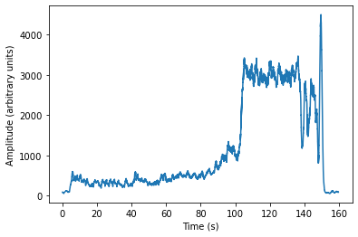
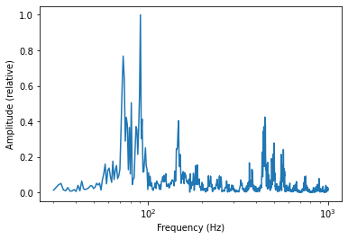

# song_analyser
Project with the goal of playing with signal analysis (fourier analysis) on regular audio files (mp3)

Programmed in anaconda
Required:
conda install -c conda-forge ffmpeg
pip install pydub

Currently this script can be used for analysing the dynamics of the song with volume_curve-function. FFT of sample periods can also be performed.

Amplitude curve of "In the hall of the mountain king"

FFT from 1-sec sample of the same song.

